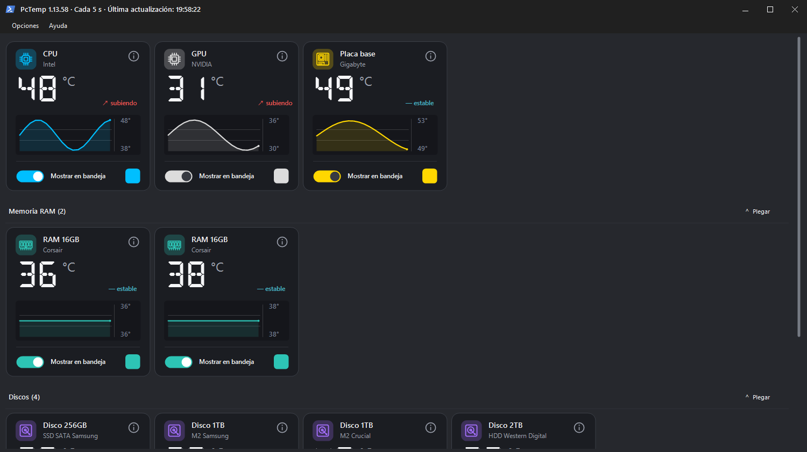

# PcTemp

Monitor ligero de hardware para Windows que reúne en una sola aplicación las temperaturas de **CPU, GPU, placa base, discos y módulos RAM compatibles**. Puede mostrar cada lectura en el área de notificaciones, se inicia de forma minimizada con Windows y permite personalizar el color y el orden de las tarjetas.



## Funciones principales

- Tarjetas adaptativas con temperatura actual, mínima y máxima de la sesión.
- Minigráficas con las últimas 60 lecturas y estado de tendencia.
- Indicadores independientes y seleccionables en la bandeja de Windows.
- Temas claro y oscuro, selector de color temático y colores guardados por dispositivo.
- Grupos plegables para módulos RAM y unidades de almacenamiento.
- Reordenación visual mediante arrastrar y soltar.
- Detección automática de GPU: la tarjeta se oculta si no existe una lectura válida.
- Selección automática o manual del sensor de placa base, VRM o chipset.
- Filtrado de valores anómalos y saltos bruscos en sensores de placa.
- Popup informativo específico para cada dispositivo mediante un icono vectorial.

En discos, el popup muestra modelo, estado, salud, espacio disponible, interfaz, actividad, velocidad de lectura/escritura y sensor utilizado. En RAM muestra módulo, tipo DDR, capacidad, velocidad, ranura, voltaje y sensor cuando Windows y el hardware exponen esos datos.

## Diseño

Las tarjetas usan iconos vectoriales, temperatura con tipografía digital DSEG, unidad secundaria, gráfica rellena y controles adaptados al escalado de Windows. CPU, GPU y placa base ocupan la zona principal; memoria y discos aparecen en grupos propios que pueden plegarse. Al plegarlos permanece visible un resumen de temperaturas.

La ventana calcula automáticamente una distribución cómoda —por ejemplo, 4×2 o 3×2— según la resolución y sigue siendo redimensionable. Los temas modifican la ventana completa, menús, tarjetas, scrollbar, selector de color y ventanas informativas.

## Instalación

Descarga el instalador desde **GitHub Releases**, ejecútalo y pulsa **Instalar PcTemp**. El asistente:

- permite elegir la carpeta de instalación, con `C:\Program Files\PcTemp` como propuesta;
- ofrece crear un acceso directo en el escritorio;
- configura el inicio automático mediante una tarea con privilegios altos;
- crea accesos para abrir, actualizar, reparar y desinstalar PcTemp;
- registra la aplicación en **Configuración → Aplicaciones instaladas**;
- instala o repara PawnIO 2.2.0 silenciosamente cuando sea necesario;
- permite autorizar informes anónimos de fallos para ayudar a mejorar PcTemp.

Una actualización conserva las preferencias del usuario. La desinstalación elimina los archivos, accesos, tareas, configuración y registro creados por PcTemp. PawnIO solo se retira si el instalador registró que fue incorporado por PcTemp; una instalación previa independiente se conserva.

## Uso

1. Abre PcTemp y acepta la solicitud de administrador.
2. Elige en cada tarjeta si debe aparecer en la bandeja.
3. Si Windows oculta un indicador nuevo, actívalo desde **Personalización → Barra de tareas**.
4. Haz doble clic en un indicador para abrir el panel.
5. Usa el menú contextual para cambiar el intervalo entre 2, 5, 10, 30 o 60 segundos.

Cuando se inicia automáticamente con Windows, PcTemp permanece minimizado. Al cerrarlo por completo también se detiene la lectura de sensores.

## Sensores y permisos

PcTemp utiliza LibreHardwareMonitor 0.9.7-pre705. Prioriza:

- **CPU:** CPU Package, Tctl/Tdie o Core Max.
- **GPU:** GPU Core.
- **Placa base:** MotherBoard/Mainboard Temperature antes que System, chipset o VRM.
- **Discos:** temperatura principal o composite de cada unidad.
- **RAM:** sensores SPD/DIMM que el módulo exponga.

Los sensores genéricos de placa como `Temperature #5` no se eligen automáticamente. Los cambios bruscos se filtran y deben repetirse en varias lecturas antes de aceptarse. Algunos controladores, cajas USB, placas o módulos RAM no exponen todos los datos; en esos casos PcTemp muestra `No disponible` u oculta la tarjeta si no existe ninguna temperatura válida.

La aplicación requiere privilegios de administrador para el acceso de bajo nivel. El instalador integra el paquete oficial firmado de PawnIO 2.2.0 y comprueba su SHA-256 antes de ejecutarlo.

## Requisitos para compilar

- Windows 10 u 11 de 64 bits.
- Windows PowerShell 5.1 o posterior.
- .NET Framework 4.7.2.
- El compilador de .NET Framework incluido en Windows.

Las dependencias necesarias están incluidas en `vendor` para permitir una compilación reproducible sin restaurar paquetes externos.

### Aplicación portátil

```powershell
powershell -ExecutionPolicy Bypass -File .\build.ps1 -Clean
```

El resultado se guarda en `PcTemp\`.

### Aplicación e instalador

```powershell
powershell -ExecutionPolicy Bypass -File .\build-installer.ps1 -Clean
```

Los resultados se guardan en `PcTemp-Release\` y `dist\`. GitHub Actions ejecuta la misma compilación y publica ambos como artefactos descargables.

## Estructura del repositorio

```text
src/          Aplicación WinForms y manifiesto
installer/    Instalador, actualización y desinstalación
assets/       Iconos, imágenes y tipografía
drivers/      Instalador oficial de PawnIO
vendor/       Bibliotecas necesarias para compilar
tools/        Utilidades de iconos y previsualización
docs/images/  Capturas usadas por la documentación
```

## Privacidad

PcTemp procesa las temperaturas localmente. El instalador permite autorizar informes anónimos de fallos; la casilla aparece marcada, puede desmarcarse antes de instalar y modificarse después desde **Opciones → Enviar informes anónimos de fallos**.

Cuando están autorizados, los informes incluyen únicamente la versión de PcTemp, versión y arquitectura de Windows, cultura, modelos generales del hardware detectado, lecturas recientes y la traza técnica del error. PcTemp anonimiza localmente el perfil, nombre de usuario y nombre del equipo, y no envía archivos, documentos, credenciales ni números de serie.

Los informes se entregan mediante el Worker de Cloudflare incluido en `report-worker/`. El servicio acepta una lista cerrada de campos, limita cada cuerpo a 48 KiB y crea incidencias en el repositorio privado `PcTemp-Reports`. El token de GitHub permanece como secreto de Cloudflare y nunca se incorpora a PcTemp, al instalador ni a este repositorio.

## Contacto

- Correo: [randomlabdev@gmail.com](mailto:randomlabdev@gmail.com)
- Proyecto: [github.com/RandomLabdDev/PcTemp](https://github.com/RandomLabdDev/PcTemp)

## Licencias

El código de PcTemp se distribuye bajo la licencia [GNU GPL-2.0](LICENSE). Las bibliotecas, PawnIO, Bootstrap Icons y DSEG conservan sus propias licencias y avisos, recogidos en [THIRD_PARTY_NOTICES.txt](THIRD_PARTY_NOTICES.txt).

Consulta [CONTRIBUTING.md](CONTRIBUTING.md) para colaborar y [RELEASING.md](RELEASING.md) para preparar una publicación.
